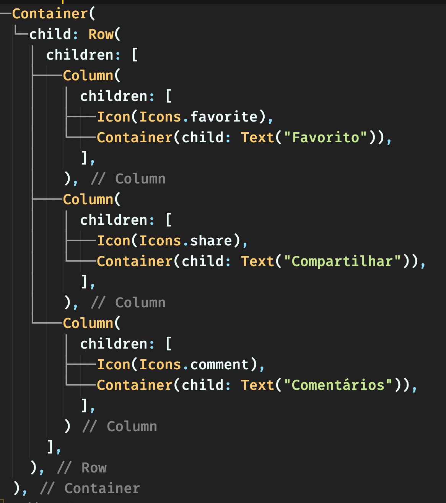
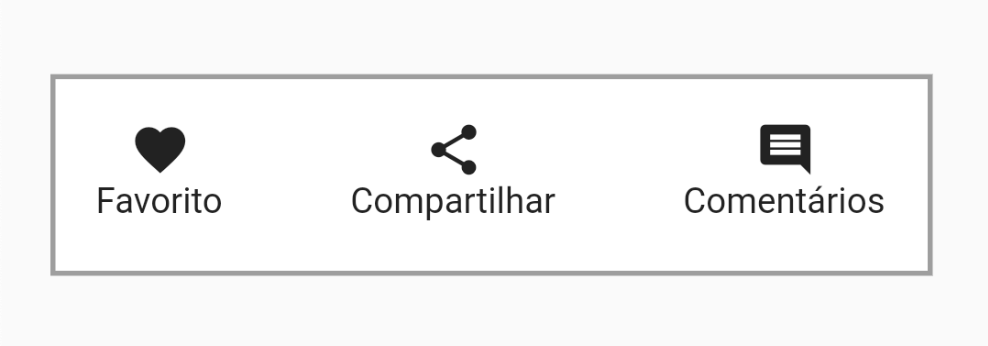

# Tech Talk - <a href="https://flutter.dev/">Flutter</a>

<!-- _footer: Code Tecnologia - 2022 -->

---

## O que é o Fluter?
Criado pelo Google em Maio de 2017
Linguagem Dart (criada em 2011) similar a <i>javascript</i>

Mais de <a href="https://medium.com/flutter/introducing-flutter-3-5eb69151622f">500.000 aplicativos publicados</a>
Compilação para código nativo
Gerenciador de pacotes <a href="http://pub.dev/">pub</a>

Framework multiplataforma:

  

  * **Android**
  * **iOS**
  * Web
  

  

  * Windows
  * MacOS
  * Linux
  

---

## Conceitos básicos
Tudo no Flutter é um widget

  

  

---

## Estrutura de projeto

#### Arquitetura
Clean Architecture
S.O.L.I.D.
Test Driven Design (TDD)
.
Modular pattern
BLoC pattern
Commander pattern
Repository pattern

#### Stack
Flutter Modular
Flutter BLoC
Dio
Hive
Dartz

Sentry
Flutter Lints
CodeUI

---

## Arquitetura - Camadas

O Clean Architecture contém 4 camadas
* Domínio
* Infraestrutura
* Externa
* Apresentação

---

## Camada de Domínio

Primeiro definimos a regra de negócio do módulo/feature
1. Criamos **ENTIDADES**, classes que representam a regra22
2. Mapeamos os **FALHAS** que podem ocorrer pelo usuário
3. Criamos uma ideia do que será feito no **REPOSITÓRIO**
4. Criamos **VALIDADORES** para os dados
5. Implementamos a regra de negócio no **USECASE**
6. Criamos **TESTES** para validar o fluxo

---

## Camada de Infraestrutura

É onde tratamos os erros e mapeamos os dados do backend
1. Criamos **MAPPERS** para converter os dados recebidos em entidades
2. Criamos uma ideia do que será feito no **DATASOURCE**
3. Mapeamos os **ERROS** que podem ocorrer ao obter os dados
4. Implementamos o **REPOSITÓRIO** tratando erros gerados
5. Criamos **TESTES** para validar o fluxo

---

## Camada Externa

É onde buscamos os dados necessários
1. Definimos as **SETTINGS** necessárias para buscar os dados
2. Implementamos o **DATASOURCE** buscando os dados e disparando quaisquer erros que ocorram
3. Criamos **TESTES** para validar o fluxo

---

## Camada de Apresentação
#### Gerência de Estado - BLoC
É onde tratamos cada ação do usuário
1. Definimos **EVENTOS** que representam as ações do usuário
2. Definimos **ESTADOS** que serão gerados a partir dos eventos
      - Estado de Loading
      - Estados de Falhas
      - Estados de Sucesso
3. Implementamos o **BLOC** tratando cada evento disparado, e emitindo os estados correspondentes
4. Criamos **TESTES** para validar o fluxo

---

## Camada de Apresentação

#### Construção de tela

É onde juntamos tudo que foi feito. Hora de deixar 'bunitu'!
1. Definimos o módulo com tudo aquilo que criamos
2. Fazemos injeção de dependência de todas as camadas
3. Criamos telas, botões, listas... que o usuário irá interagir

